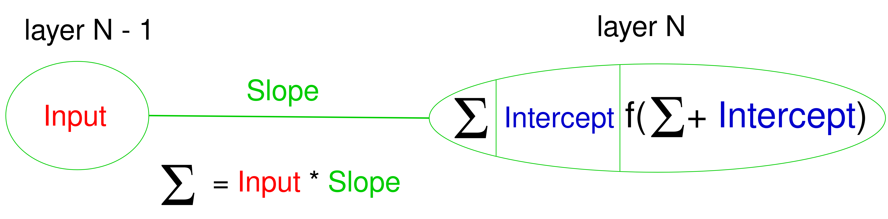
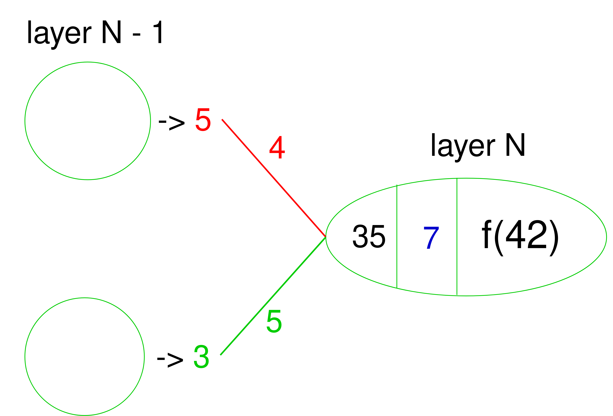
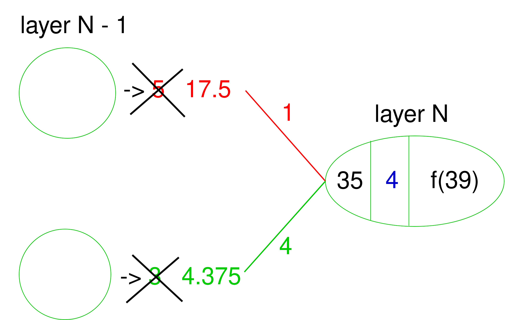
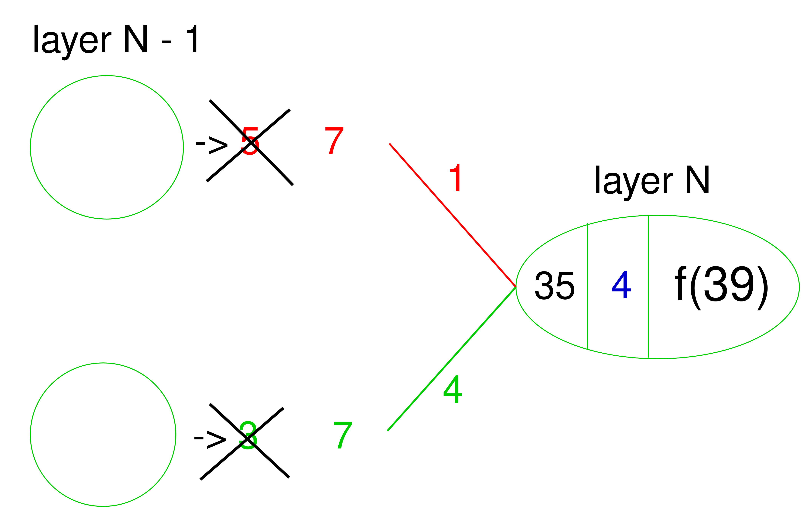

<center><h2><ins>From gradient-descent to a neural network</ins></h2></center>

This project is the rest of the previous one, [here](https://github.com/Thibaut-Le-Goff/gradient-descent-for-Runst).

The goals of this project are:
- to see what the gradient descent algorithm would look like if this was a neural network;
- to implement the algorithm in my main project, [here](https://github.com/Thibaut-Le-Goff/Runst).

<ins>As a Neural Network</ins>\
As mentioned in Runst, the propagation works by multiplying a matrix of weights by a vector of outputs from the neurons at layer $N - 1$:

<p align="center">
    
</p>

But I didn't mention the addition of the bias between the multiplication and the activation functions.

This is important because the formula of the value stored in a neuron before the activation function is:

$$(\sum_{i=1}^{\textrm{\color{red}nb neurons N - 1}}\textrm{\color{green} Weight}_i * \textrm{\color{red}neuron N - 1}_i) + \textrm{\color{blue}Bias}$$

If the neural network is only one neuron connected to another one we get:

$$(\sum_{i=1}^{1}\textrm{\color{green} Weight}_i * \textrm{\color{red}neuron N - 1}_i) + \textrm{\color{blue}Bias}$$

$$\implies \textrm{\color{green} Weight} * \textrm{\color{red}neuron N - 1} + \textrm{\color{blue}Bias}$$

This is quite familiar to the formula of a line:
$$\textrm{\color{green} Slope} * \textrm{\color{red}Input} + \textrm{\color{blue}Intercept}$$

Or

$$y = \textrm{\color{green} a} * \textrm{\color{red}x} + \textrm{\color{blue}b}$$

Tha would means gradient descent as a neural network may look like:

<p align="center">
    
</p>

( $\textrm{\color{red}Input}$ is the value the neurone have after the activation function)

<ins>Propagation and gradient-descent</ins>\
I need to know what to change to the gradient descent algorithm to implement it in the project.

And these changes are:
|Before the implementation|Change needed for the implementation|
|-|-|
|The starting values of the $\textrm{\color{green}Slope}$ and $\textrm{\color{blue}Intercept}$ are both $0$.|Since the $\textrm{\color{green}Slope}$ is the $\textrm{\color{green}Weight}$ and the $\textrm{\color{blue}Intercept}$ is the $\textrm{\color{blue}Bias}$, those values will be given in ```input``` by the function who initialised the $\textrm{\color{green}Weight}$ and the $\textrm{\color{blue}Bias}$ of the neural network.
|During the gradient descent process the ```predicted_value``` is given by the formula $\textrm{\color{green}Slope} * \textrm{\color{red}sample} + \textrm{\color{blue}Intercept}$. The $\textrm{\color{green}Slope}$ and $\textrm{\color{blue}Intercept}$ change after all the $\textrm{\color{red}sample}$ have been tested. This process repeat itself until the good $\textrm{\color{green}Slope}$ and $\textrm{\color{blue}Intercept}$ are found.|Since the $\textrm{\color{green}Slope}$ is the $\textrm{\color{green}Weight}$, the $\textrm{\color{red}sample}$ is still the $\textrm{\color{red}sample}$ and the $\textrm{\color{blue}Intercept}$ is the $\textrm{\color{blue}Bias}$, the $\textrm{\color{green}Weight}$ and $\textrm{\color{blue}Bias}$ will not need any ```input``` because they will change over time but the $\textrm{\color{red}sample}$ will be given in ```input``` by the data set.|
|$$\frac{\partial \color{blue}Squares}{\partial \color{green} Slope} = \frac{\partial \color{blue}Squares}{\partial \color{red} \textrm{\color{red}Prediction line}} * \frac{\partial \textrm{\color{red}Prediction line}}{\partial \color{green} Slope}$$|$$\frac{\partial \color{blue}Squares}{\partial \color{green} Slope} = \frac{\partial \color{blue}Squares}{\partial \textrm{\color{black}Activation fun}} * \frac{\partial \textrm{\color{black}Activation fun}}{\partial \color{red} \textrm{\color{red}Prediction line}} * \frac{\partial \textrm{\color{red}Prediction line}}{\partial \color{green} Slope}$$|
|$$\frac{\partial \color{blue}Squares}{\partial \color{green} Intercept} = \frac{\partial \color{blue}Squares}{\partial \textrm{\color{red}Prediction line}} * \frac{\partial \textrm{\color{red}Prediction line}}{\partial \color{green} Intercept}$$|$$\frac{\partial \color{blue}Squares}{\partial \color{green} Intercept} = \frac{\partial \color{blue}Squares}{\partial \textrm{\color{black}Activation fun}} * \frac{\partial \textrm{\color{black}Activation fun}}{\partial \color{red} \textrm{\color{red}Prediction line}} * \frac{\partial \textrm{\color{red}Prediction line}}{\partial \color{green} Intercept}$$|
|||
|||

<ins>hypothesis:</ins>\
With respect to the sum in the neuron at layer $N$, we want to calculate what should be the $\textrm{\color{red}weight W1}$, the $\textrm{\color{blue}bias}$, and the sum the neuron at layer $N - 1$ receive (to create a loop):

<p align="center">
    
</p>

The problem is:
If the neuron at layer $N$ tells to both neurons at layer $N - 1$ he expects $\sum$, each of them will want to give it $\sum$ and it will get $2 * \sum$ instead of $\sum$.

Maybe this problem could be solved if the neuron at layer N asks $\sum / 2$ to both neurons at layer $N - 1$.

This hypothesis is false(this is still another one):

The $\color{blue}bias$ is calculated is the one at the layer $N$ not $N - 1$:

<p align="center">
    
</p>

<ins>How the program could turn into a loop through the layers</ins>

During the propagation process the neurons at layer $N - 1$ give their signals to the neuron at $N$:

<p align="center">
    
</p>

During the backpropagation process the weights and the bias change values.

The problem is the fact that the weights change of values also changes the sum which changes the outputs of the neuron $N$:

<p align="center">
    
</p>

The solution is probably to change the values sent by the neurons $N - 1$, to trace back what should be those values:
For the first neuron:
$$(35 / 2) / \color{red}1 \color{black} = 17.5$$
(2 for the number of neurons who participated in the sum)

For the second neuron:
$$(35 / 2) / \color{green}4 \color{black} = 4.375$$

<p align="center">
    
</p>

Another way may be to divide the sum by how much the weight participated to it :
(at the propagation)
<p align="center">
    
</p>

For the first neuron participated at $57\%$ in the sum:
$$(\color{red}5 * 4\color{black}) / 35 \approx 0.57$$
$$(35 * ((\color{red}5 * 4\color{black}) / 35)) / \color{red}1 \color{black} = 20$$

For the second neuron participated at $43\%$ in the sum:
$$(\color{green}3 * 5 \color{black}) / 35 \approx 0.43$$
$$(35 * ((\color{green}3 * 5 \color{black}) / 35)) / \color{green}4 \color{black} = 3.75$$

<p align="center">
    
</p>

Calculated with the participation in terms of weights:
For the first neuron:
$$(35 * (\color{red}1 \color{black} / 5)) / \color{red}1 \color{black} = 7$$

For the second neuron:
$$(35 * (\color{green}4 \color{black} / 5)) / \color{green}4 \color{black} = 7$$

<p align="center">
    
</p>

The last one is probably the best only with this example.