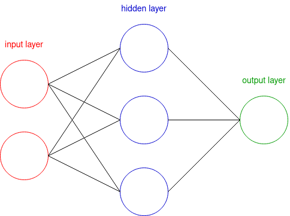
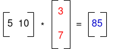
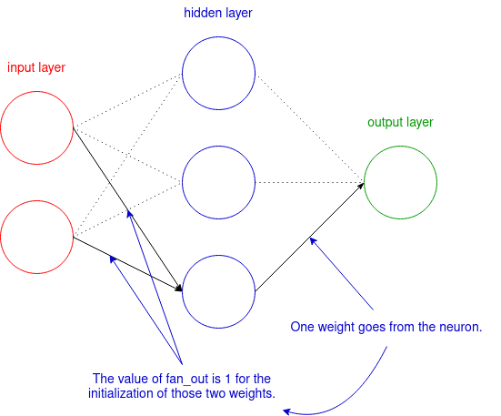
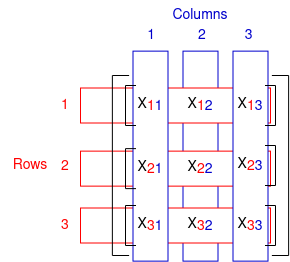
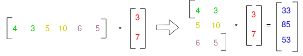
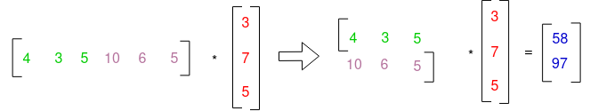

 <center><h2><ins>Runst, a project to learn neural network and Rust</ins></h2></center>

As Runst is a big project, I must have a deep understanding of what I am doing and why.
And I learned through my school projects that explaining what I did force me to tackle subjects I skimmed over when I was doing those and have a better understanding of my project.

My goal is to create a module that will make easier the creation of a neural network.

<h5><ins>What is a neural network</ins></h5>
A neural network can be separated in three main area:
<p align="center">
    
</p>

- Informations relative to what we are looking for are put in the input layer; 
- The hidden layer do all the calculations to get a result with the information put in the input layer;
- The output layer will show the result and compare it to the result that was expected.

Each of those layers have a certain number of nods called neurones who are connected to the neurones of the adjacents layers by what is called weights.

To make the neural network work the neurones in the input layer will send the informations they hold to the neurones in the hidden layer through the weight. But the weight will have an effect on the informations sent, it will multiply it by the value of the weight:

Then the neurones in the hidden layer will make the sum of the informations sent by the neurones of the input layer multiplied by the weights:
<p align="center">
    
</p>

In this example, the first neurone sends the number 3 through a weight with the value 5, which means that the neurone in the hidden layer will take 3 * 5 = 15.

But, the neurone will also take the information sent by the second neurone of the input layer, 7, with the weight of the value 10, which makes 70.

The neurone will make the sum of 15 and 70 which is 85, the final value that will use the neurone with something called the activation function, a function that will determine the value that will be sent to the neuron of the output layer.

This can be sum up with matrices:
<p align="center">
    
</p>

In this example the matrice [5 10] is multiplied by the vector [3 7] , which give us 85.

Matrices can help us to calculate all the neurones in the hidden layer at the same time:
<p align="center">
    
</p>

With the result in the vector [33 85 53] , the neurones in the hidden layer can calculate values they will send to the next layer with a activation function.

But, before going further with the concepts of activation function, I want to explain my code.

<h5><ins>My code</ins></h5>
<ins>Weight initialisation:</ins> 

First I have to initialise the weitghs and they can be created in a matrix, I created à function that will take as input the number of column and the number of row and will out put the matrix which is a vecor of vectors of floats in 64 bits:
```rust
pub fn uniform_dis(column: usize, row: usize) -> Vec<Vec<f64>> {
```
We come to some things I didn't mention, the weights are initialised randomly betwen two numbers and those number are determined by the type of initialisation we choose, here I choose an uniform distribution.

The formula to detemine the two numbers are:
<p align="center">
    
</p>

Here fan_in is equal to the number of weights coming toward one neuron, the number of neurons in the previous layer in short, for example:

<p align="center">
    
</p>
There is also fan_out which is equal to the number of weights coming from one neuron, the number of neurons in the next layer:
<p align="center">
    
</p>

In my code it's make:
```rust
    let a: f64 = -1.0 / (column as f64).sqrt();
    let b: f64 = 1.0 / (column as f64).sqrt();
    // .sqrt() only works with float
```
Here I use the number of columns in the matrix I want to create because in form of matrices, the number of weights going toward one neuron, fan_in, is the number of columns in the matrix of the weights:
<p align="center">
    
</p>
After the calculation of a and b, I put the number of columns and rows in the matrix I want to create, a and b in the function random:
```rust
    let matrix: Vec<Vec<f64>> = random(column, row, a, b);
```

The function random will output the matrix I want and look like this:
```rust
pub fn random(column: usize, row: usize, a: f64, b: f64) -> Vec<Vec<f64>> {
    use rand::{thread_rng, Rng}; 
        
    let mut matrix: Vec<Vec<f64>> = vec![vec![0.0; column]; row];
    let mut rng = thread_rng();

    for i in 0..= (row - 1) {	
        for j in 0..= (column - 1) {
            let rand: f64 = rng.gen_range(a..=b);
            // the weights have to be random betwen a and b
            matrix[i][j] = rand;
        }
    }
    return matrix;
}
```
Here, I create a vector with a number of vectors inside it equal to the number of rows I want in the matrix, and inside the vectors I put a number of floats 64 equal to the number of columns I want in the matrix.

If I wanted to create à 3x3 matrix, it would work like it:
<p align="center">
    
</p>

Here each element of the rows is concatenated in the same vectors, but the elements of the columns are in each vector, that is why I am creating the vectors with the number of columns as the length in the vector with the number of rows as the length.
That also explains why in the for loops I am going first on each row and in each column in it.

But as someone told me, using a vector of vectors as a matrix is not the best option(cf: https://users.rust-lang.org/t/how-can-i-use-the-crate-rayon-to-multiply-a-matrix-by-a-vector/80698), so I managed to rewrite it in order to use only a vector as a matrix :
```rust
pub fn multiply(matrix: &Vec<f64>, vector: &Vec<f64>) -> Vec<f64> {

    let result_lenght: usize = matrix.len() / vector.len();
    let mut result: Vec<f64> = vec![0.0; result_lenght];
    let mut counter: usize = 0;

    for i in 0..= result_lenght - 1 {
        let mut x: f64 = 0.0;

        for j in 0..= vector.len() - 1 {
            x = (&vector[j] * &matrix[counter]) + x;
            counter = counter + 1;
        }
        result[i] = x;
    }
    return result;
}
```
The problem, if I have only one vector as a matrix, is the absence of rows but, if I follow the rule who says that to multiply a matrix by a vector, the row's length in the matrix has to be equal to the length of the vector, I can create the rows by dividing the vector as a matrix by the vector:

<p align="center">
    
</p>

I can also multiply this vector as a matrix by a vector with another length: 

<p align="center">
    
</p>

I think this will be useless in a neural network, but I think that could make possible a sort of transformation of the network, I need to test it:

<p align="center">
    
</p>